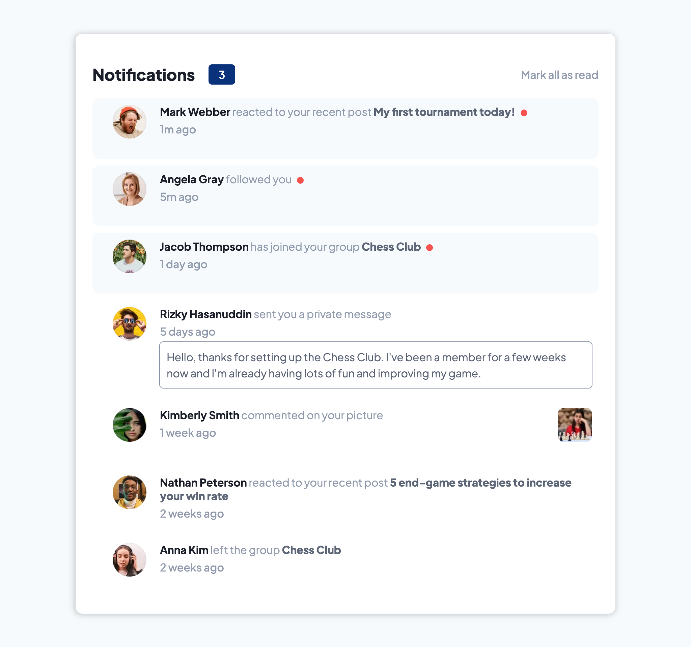
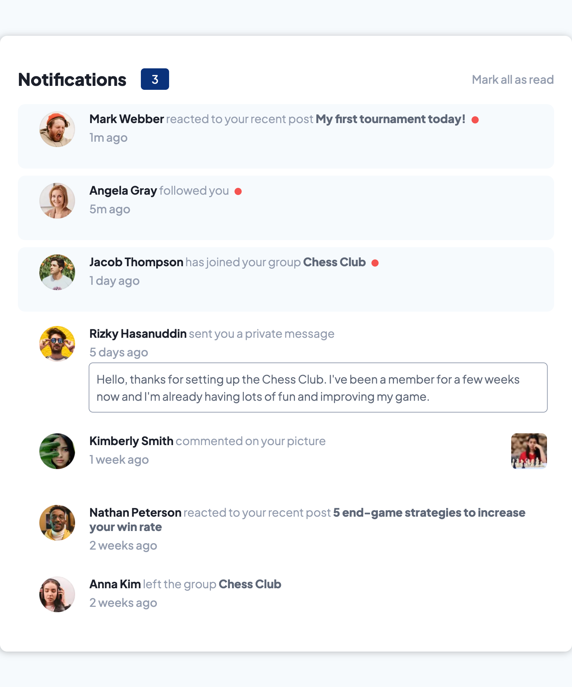
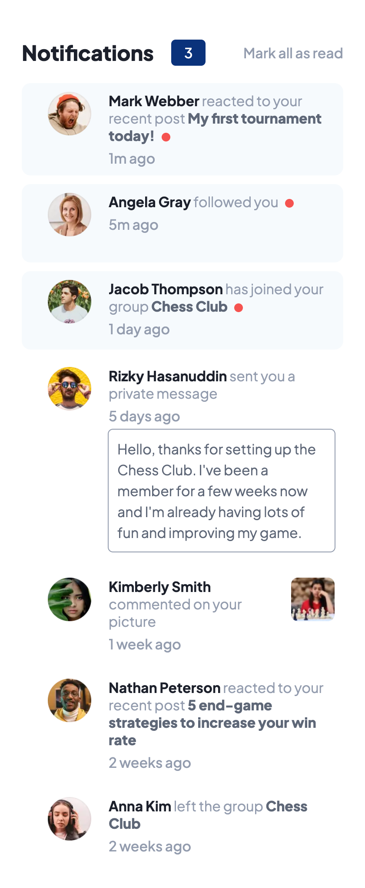

# Frontend Mentor - Notifications page solution

This is a solution to the [Notifications page challenge on Frontend Mentor](https://www.frontendmentor.io/challenges/notifications-page-DqK5QAmKbC)


## Table of contents

- [Overview](#overview)
  - [The challenge](#the-challenge)
  - [Screenshot](#screenshot)
- [What I learned](#what-i-learned)


## Overview

### The challenge

Users should be able to:

- Distinguish between "unread" and "read" notifications
- Select "Mark all as read" to toggle the visual state of the unread notifications and set the number of unread messages to zero
- View the optimal layout for the interface depending on their device's screen size
- See hover and focus states for all interactive elements on the page

### Screenshot
<strong>Desktop 1024px</strong>


<strong>Tablet 768px</strong>


<strong>Mobile 375px</strong>


## [What I learned](#what-i-learned)🧗‍♀️

1. Get the closest parent (which could be several levels up) of a child element using `childElem.closest(some unique parent class)`. This method allows you to traverse up the DOM tree and find the nearest ancestor that matches the specified selector.

### Example:
```javascript
const newNotifs = document.querySelectorAll(".unread");

// For each element in newNotifs, console log the closest parent with .notif-main class
newNotifs.forEach((element) => {
  console.log(element.closest(".notif-main"));
});
```


